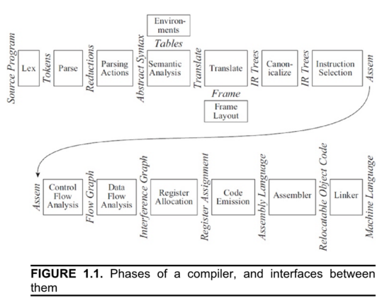
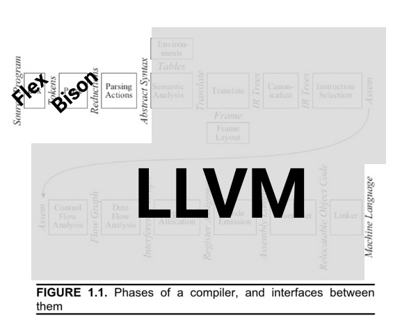

# MiniJava-Compiler
Jemar Jones
Jimmy Wang

April 2016

##Introduction
MiniJava is a subset of Java. It's BNF can be found at [http://www.cambridge.org/resources/052182060X/MCIIJ2e/grammar.htm](http://www.cambridge.org/resources/052182060X/MCIIJ2e/grammar.htm)

MiniJava-Compiler is a compiler for the MiniJava language that compiles to LLVM IR (a low level programming language similar to assembly) which then compiles to assembly for your machine.

MiniJava-Compiler is written in C++. It uses **flex** the lexical analyzer generator (getting tokens) and **Bison** the parser generator. It uses llvm 3.6's api to generate LLVM IR Code.

Typical phases of a compiler

Using Flex, Bison and LLVM. They abstract away details so we don't have to worry about them.

##Building
###Versions

+ flex 2.5.35 ~ 2.6.0
+ bison 3.0.4
+ llvm 3.6
    - opt-3.6 (installed with llvm)
    - llc-3.6 (installed with llvm)

###Instructions for OS X

OS X comes with flex 2.5.35
However you need to install Bison because the OS X provided Bison is 2.3
~~~
brew install bison
~~~

~~~
brew tap homebrew/versions
brew install llvm36
~~~

Add llvm homebrew to your PATH
`export PATH=/usr/local/opt/llvm36/bin:$PATH`
This gives you access to `llvm-config-3.6` needed to compile llvm code

###Instructions for Linux
You will need to install right versions of flex, bison and llvm.

Modify the **Makefile**
These are the 2 lines, you need to change to point to what your llvm config is called making sure it's version 3.6 and pointing to the right bison.
~~~
LLVMCONFIG = llvm-config-3.6
BISON = /usr/local/Cellar/bison/3.0.4/bin/bison
~~~

Modify **mjavac**
Replace `opt` and `llc` with whatever installed version you have on your machine. `opt` and `llc` are installed with llvm.
~~~
opt-3.6 -S -O3 $name.ll -o $name.ll
llc-3.6 -filetype=obj $name.ll
~~~

##Running
Run `make` once

`./mjavac` script that will create the `.ll` (LLVM IR) and compile it to a binary in the current directory.
~~~
./mjavac programs/QuickSort.java
./QuickSort
~~~

Example: Quicksort output
~~~
20
7
12
18
2
11
6
9
19
5
9999  // Separator. End initial list of elements
2
5
6
7
9
11
12
18
19
20
0     // Separator. End sorted list of elements
~~~

`./mjavac`
1. Create a file called `QuickSort.ll`, a LLVM IR code file.
2. Create a file called `QuickSort`, a native executable.
3. The last file created will be called `Output_AST.txt` that represents the AST of the java file parsed.

##Tests
We tested our implementation by compiling in Java and running it, then testing that against MiniJava-Compiler and running it. We checked that the output was the same.

The programs we used to test are in the `programs` folder

+ BinarySearch.java
+ BubbleSort.java
+ LinearSearch.java
+ QuickSort.java
+ BinaryTree.java
+ Factorial.java
+ LinkedList.java [LinkedList does not work with our Compiler, known problem]

Refer to generated `.ll` files in folder `Generated-llvm-code-from-programs` if you want to see example compiled to llvm IR code.

##Code Documentation
In our proposal we said we were going to use noweb. However, we found docco the html literate programming tool much easier to use.

To view code documentation open [docs/main.html](./docs/main.html). The links to the generated literate documentation for other code files is linked via a table of contents.

##ANALYSIS AND DESIGN
###3 stages

1. Tokenization (`tokens.l` - scan the `.java` file passed in)
2. Build the AST (`parser.y` - match BNF rules and built an appropriate AST)
3. Code Generation using the AST

Java file that is passed.

~~~java
class Test{
    public static void main(String[] args) {
        Bar myBar;
        myBar = new Bar();
        if (myBar.setNum(10)){
            System.out.println(myBar.getNum());
        } else {

        }
    }
}
class Bar{
    int a;
    public int getNum(){
        return a;
    }
    public boolean setNum(int newVal){
        a = newVal;
        return true;
    }
}
~~~

From the java file. MiniJava-Compiler builds an AST.
~~~
PROGRAM:
  MainClass(Test):
    MethodDeclaration(main : void):
      PARAMETERS:
        args : String[]
      VarDeclaration:
        myBar : Bar
      BODY:
        VAR_ASSIGN(myBar):
          EXPRESSION:
            NEW_CLASS(Bar)
        IF_ELSE:
          COND:
            METHOD_CALL(setNum):
              OBJECT:
                VARNAME(myBar)
              EXP_LIST:
                INT_CONST(10)
          TRUE:
            BLOCK:
              SYS_OUT:
                METHOD_CALL(getNum):
                  OBJECT:
                    VARNAME(myBar)
                  EXP_LIST:
          FALSE:
            BLOCK:
      RETURN:
  CLASSES:
    ClassDeclaration(Bar):
      FIELDS:
        a : int
      METHODS:
        MethodDeclaration(getNum : int):
          PARAMETERS:
            this : Bar
          VarDeclaration:
          BODY:
          RETURN:
            VARNAME(a)
        MethodDeclaration(setNum : boolean):
          PARAMETERS:
            this : Bar
            newVal : int
          VarDeclaration:
          BODY:
            VAR_ASSIGN(a):
              EXPRESSION:
                VARNAME(newVal)
          RETURN:
            BOOL_CONST(true)
~~~

---

What MiniJava-Compiler currently doesn't do is semantic analysis (lexical errors, syntax errors, type checking, etc). This would be a planned future feature. We would have to build a symbol table and do semantic analysis on that.